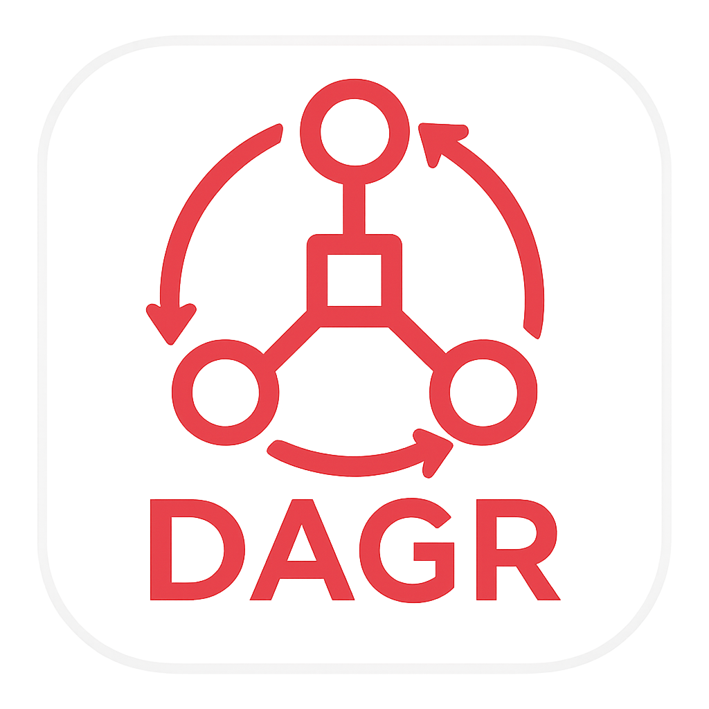

  

Dagr is a high-performance, type-safe binary serialization framework for Swift. It uses a schema-first, code-generation approach to automatically create all the boilerplate code needed to build, read, and manage complex data graphs. This provides the raw performance of a custom binary format with the safety and developer-friendly ergonomics of a native Swift framework.

## Why Dagr?

Swift's standard `Codable` protocol is fantastic for working with formats like JSON, but it can be too slow or produce verbose output for performance-critical applications. On the other end, frameworks like Protocol Buffers or FlatBuffers offer high performance but can feel foreign in a Swift project, often requiring external tools and lacking support for complex object graphs.

Dagr was built to fill this gap, offering a "best of both worlds" solution with the following key advantages:

### High Performance
*   **Compact Binary Format:** Serialized data is significantly smaller than its JSON or XML equivalent, saving disk space and network bandwidth.
*   **Fast Serialization:** Bypasses the overhead of text-based parsing for maximum speed.
*   **Memory Optimization:** The DSL allows for fine-grained performance tuning via `frozen` and `sparse` attributes on nodes, directly impacting their binary footprint:
    *   **VTable Overhead:** Regular nodes use a Variable Table (VTable) to store offsets to their fields. This adds a small overhead (1-8 bytes per field) but provides flexibility. `sparse` nodes optimize this by only including entries for present fields, significantly reducing overhead for data with many optional/absent fields.
    *   **Frozen Nodes:** For stable, dense data structures, `frozen: true` eliminates VTable overhead entirely. Fields are laid out in a fixed, sequential order, and optional fields are tracked via a compact bitset, resulting in the smallest possible binary footprint and fastest access.

### Type Safety & Developer Experience
*   **Zero Boilerplate:** The code generator writes all the serialization logic for you, eliminating manual, error-prone work.
*   **Compile-Time Safety:** Define your schema in Swift and get full autocompletion and compile-time checks. Typos and type mismatches are caught by the compiler, not at runtime.
*   **Seamless Integration:** A native Swift Package Manager plugin automates code generation as part of your normal build process.

### Advanced Data Modeling
*   **Full Graph Support:** Dagr is explicitly designed to handle complex object graphs, including **cyclical references**, which cause many other frameworks to fail.
*   **Rich Type System:** Provides first-class support for not just structs (`Node`), but also **enums (`Enum`)** and **tagged unions (`UnionType`)**, including arrays of unions.

### Robust Schema Evolution
*   **Automated Compatibility Validation:** Dagr automatically saves a fingerprint of your schema and, on subsequent builds, validates that any changes are backward-compatible. This prevents you from accidentally shipping a breaking change.
*   **Forward & Backward Compatibility:** The framework is designed to allow new code to read old data and old code to safely ignore fields from new data.

#### Enum and Union Capacity Evolution

Dagr automatically derives the `byteWidth` (number of bytes reserved in the binary format) for `Enum` and `UnionType` based on their current number of cases. However, users **can also explicitly set a `capacity`** when defining these types in the DSL. This `capacity` directly influences the `byteWidth` and is crucial for future expansion:

*   **Breaking Change:** Adding new cases that cause the `byteWidth` to increase (e.g., going from 255 cases to 256, which requires moving from 1 byte to 2 bytes) is a **breaking change**. This also applies if you explicitly change the `capacity` value. Older code expecting a smaller `byteWidth` will not be able to correctly read the data.
*   **Workaround for Future Compatibility:** To reserve space for future cases and avoid breaking changes, you can initially define a `capacity` value in your DSL that is larger than currently needed. This ensures that subsequent additions of real cases (up to the reserved `capacity` limit) will not alter the binary format.

### Ideal Applications for Dagr

Dagr is particularly well-suited for applications where the performance, type safety, and efficient handling of complex data models are paramount, and where standard serialization solutions (like JSON/`Codable`) might fall short.

*   **Games:** Saving and loading game state, managing complex in-game entities (characters, inventory, world objects) and their relationships, or bundling game assets.
*   **Mobile Applications with Rich Offline Data:** Apps that cache large amounts of structured data locally (e.g., content management apps, productivity tools, health trackers, e-commerce catalogs).
*   **High-Performance Server-Side Swift Applications:** Building APIs, microservices, or backend systems in Swift that require high throughput and low latency for data exchange between services or with clients.
*   **Embedded Systems and IoT Devices (if using Swift):** Data logging, configuration storage, or inter-device communication on resource-constrained hardware.
*   **Applications with Complex, Interconnected Data Models:** Any application where data naturally forms a graph (e.g., social networks, knowledge bases, document structures with cross-references, CAD/design software data).

## Binary Format Specification

The Dagr binary format is a custom, compact, and efficient serialization format designed for Swift object graphs. It's built from the "end backwards" by the `DataBuilder` and read from the "beginning forwards" by the `DataReader`.

#### 1. Overall Structure

The format is essentially a contiguous block of bytes. Objects and data are laid out sequentially. References between objects are handled using offsets, which can be absolute or relative.

#### 2. Variable-Length Integer Encoding (LEB128)

Dagr uses a custom LEB128 (Little Endian Base 128) encoding for lengths, counts, and offsets.
*   **Encoding:** Each byte uses 7 bits for data and the most significant bit (MSB) as a continuation flag. If the MSB is `1`, more bytes follow. If `0`, it's the last byte.
*   **Signed LEB (ZigZag):** For signed integers (like relative offsets), a ZigZag encoding is applied before LEB128 to map negative and positive numbers efficiently to unsigned values.
*   **Functions:** `storeAsLEB`, `readAndSeekLEB`, `readAndSeekSignedLEB`.

#### 3. Primitive Types

*   **Numeric Types (`UInt8`, `Int32`, `Float64`, etc.):**
    *   Stored directly as their raw byte representation.
    *   **Encoding:** `store(number: T)`
    *   **Decoding:** `readNumeric<T>()`
*   **Booleans (`Bool`):**
    *   Stored as a single `UInt8` (0 for `false`, 1 for `true`).
    *   **Encoding:** `store(number: UInt8)`
    *   **Decoding:** `readBool()`
*   **Strings (`String`):**
    *   Stored as UTF8 bytes.
    *   **Format:** `[LEB128_Length] [UTF8_Bytes]`
    *   **Encoding:** `store(string: String)`
    *   **Decoding:** `readAndSeekSting()`
*   **Data (`Data`):**
    *   Stored as raw bytes.
    *   **Format:** `[LEB128_Length] [Raw_Bytes]`
    *   **Encoding:** `store(data: Data)`
    *   **Decoding:** `readAndSeekData()`

#### 4. Arrays

Arrays are stored with their elements laid out sequentially, often preceded by a length. Arrays with optional elements include a bitmask.

*   **General Array Format:** `[LEB128_Count] [Element_1] [Element_2] ... [Element_N]`
*   **Arrays with Optionals:** `[LEB128_Count] [Element_1] ... [Element_N] [Bitmask]`
    *   The `Bitmask` is a bit-packed array of booleans indicating if each element is present (`true`) or `nil` (`false`).
*   **Bit-Packed Arrays (Booleans, 1-bit, 2-bit, 4-bit):**
    *   Booleans are packed 8 per byte.
    *   1-bit, 2-bit, 4-bit numbers are packed into bytes to save space.
    *   **Encoding:** `store(bools:)`, `store(oneBitArray:)`, `store(twoBitArray:)`, `store(fourBitArray:)`
    *   **Decoding:** `readAndSeekBoolArray()`, `readAndSeekSingleBitArray()`, `readAndSeekTwoBitArray()`, `readAndSeekFourBitArray()`
*   **Arrays of References (Strings, Data, Nodes, Unions):**
    *   Instead of storing the actual data inline, these arrays store **relative offsets** to where the actual data is located elsewhere in the buffer.
    *   **Format:** `[LEB128_EncodedLengthAndWidthCode] [Relative_Offset_1] ... [Relative_Offset_N]`
    *   The `EncodedLengthAndWidthCode` combines the array count and a "width code" (0-3) indicating the byte width of each relative offset (1, 2, 4, or 8 bytes).
    *   **Encoding:** `store(strings:)`, `store(datas:)`, `store(structNodes:)`, `store(unionTypes:)`
    *   **Decoding:** `readAndSeekStringArray()`, `readAndSeekDataArray()`, `readAndSeekStructArray()`, `readAndSeekUnionTypeArray()`

#### 5. Nodes (Structs)

Nodes are complex objects with fields. Their layout depends on whether they are `frozen` or `sparse`.

*   **General Node Format:** `[VTable/SparseVTable] [Field_Data_1] [Field_Data_2] ...`
*   **VTable (Virtual Table):** An array of offsets to the actual field data within the node's block. This allows for flexible field ordering and optional fields.
*   **`frozen` Nodes:** Optimized for fixed layouts. Their fields are likely laid out contiguously, potentially without a full vTable, or with a very compact one.
*   **`sparse` Nodes:** Optimized for nodes with many optional/absent fields. Their vTable only stores entries for fields that are actually present, along with their index.
*   **References within Nodes:** Fields that are references to other `Node` instances are stored as offsets.
    *   **Forward References/Cycles:** Dagr uses a "late binding" mechanism (`nodesForLateBinding`) during serialization to back-patch pointers for forward references or cycles. During deserialization, a cache (`structCache`) is used to reconstruct cycles.
*   **Encoding:** `store(structNode: Node)` (which calls `node.apply(builder:)`)
*   **Decoding:** `getStructNode<T: Node>(from offset: UInt64)` (which calls `T.with(reader:offset:)`)

#### 6. Enums

Enums are stored as their underlying numeric value.

*   **Format:** `[Numeric_Value]`
*   The size of the numeric value (1, 2, 4, or 8 bytes) depends on the enum's `byteWidth` (determined by its number of cases).
*   **Encoding:** `store(enum: T)`
*   **Decoding:** `readAndSeekEnum<T: EnumNode>()`

#### 7. Union Types

Unions are stored as "tagged unions," meaning they include a tag (type ID) to indicate which variant they represent.

*   **Format:** `[LEB128_TypeID] [Payload_Data]`
*   **Type ID:** A compact integer that identifies the specific case of the union.
*   **Payload Data:** The serialized data of the associated value for that union case.
*   **Encoding:** `store(unionType: AppliedUnionType)`
*   **Decoding:** `readAndSeekUnionTypeArray<T: UnionNode>()` (for arrays of unions, individual unions are handled by `T.from(typeId:value:reader:offset:)`)

#### 8. Memory Layout and Endianness

*   **Endianness:** Dagr's numeric serialization (`store(number: T)`) directly copies the raw bytes of Swift's native numeric types. This implies that the format uses the **native endianness** of the system on which the data was serialized (typically Little-Endian on modern Intel and ARM architectures).
    *   **Implication:** For cross-platform compatibility (e.g., reading data serialized on a big-endian system on a little-endian system), explicit endianness conversion would be required, or the format would need to standardize on a fixed endianness. Currently, it relies on the host system's endianness.
*   **Alignment:** The `UnsafeMutableRawPointer.allocate` call specifies an `alignment: 1`, meaning no specific byte alignment is enforced for the overall buffer. Individual numeric types are copied byte-by-byte, so their internal alignment is handled by Swift's `MemoryLayout`.

#### 9. Error Handling within the Format

The `DataReader` is designed to be robust against malformed or truncated data, throwing specific errors rather than crashing.

*   **`ReaderError.badOffset`:** Thrown when an attempt is made to read or seek beyond the bounds of the provided `Data` buffer. This prevents out-of-bounds reads and crashes.
*   **`ReaderError.unfinishedLEB`:** Thrown if an LEB128 sequence is encountered that doesn't terminate (i.e., the MSB is always `1` but the data ends).
*   **`ReaderError.unfittingString`, `unfittingData`, `unfittingNumericType`, etc.:** Thrown when a length or offset indicates data that would extend beyond the buffer, or if the data cannot be interpreted as the expected type.
*   **`BuilderError.wentOverMaxSize`:** Thrown by the `DataBuilder` if the serialized data exceeds the predefined `maxSize` (defaulting to `Int32.max`), preventing excessive memory allocation.

#### 10. Key Design Principles

The Dagr binary format is built upon several core principles:

*   **Compactness:** Achieved through variable-length encoding (LEB128), bit-packing for booleans and small integers, and storing references/offsets instead of duplicating data.
*   **Efficiency:** Designed for fast serialization and deserialization by minimizing parsing overhead and directly manipulating memory.
*   **Type Safety:** The format is strictly typed, and the generated Swift code ensures that data is read and written according to the defined schema, preventing type mismatches.
*   **Graph Support:** Explicitly handles complex object graphs, including cyclical references, by tracking object identities and using a combination of forward and backward pointers.
*   **Schema Evolution:** The format supports backward and forward compatibility through its design (e.g., allowing new fields to be added and old fields to be skipped) and is enforced by the code generator's compatibility validation.
*   **Swift-Native:** The design aligns with Swift's memory model and type system, making it feel natural for Swift developers.

#### 11. Extensibility and Future Considerations

The format's design, particularly its use of LEB128 for lengths and offsets, and its vTable/sparse vTable mechanisms for nodes, provides inherent extensibility.

*   **Adding New Fields:** New fields can be added to existing nodes without breaking compatibility with older readers (as older readers will simply ignore unknown fields).
*   **Adding New Types:** New `Node`, `Enum`, or `UnionType` definitions can be introduced.
*   **Version Information:** While not explicitly seen in the binary format itself, the `GenerationProtocol` JSON files (which store the schema and a timestamp) provide a mechanism for tracking schema versions outside the binary data, which is crucial for managing complex evolution scenarios.

## License

This project is licensed under the MIT License - see the [LICENSE](LICENSE) file for details.
